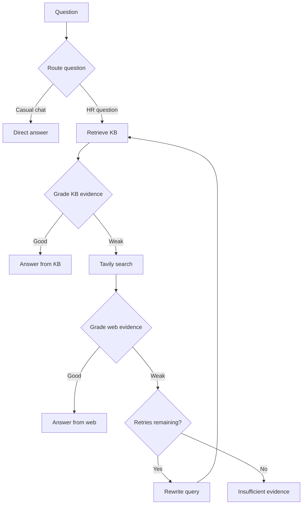

# 🧠 Agentic RAG Chatbot for HR Policy & Employee Support

> A tutorial-based HR knowledge assistant with conditional retrieval, evidence grading, web-search fallback, and query rewriting—built with LangGraph, Groq, Pinecone, and FastAPI.


This repository is a learning and portfolio implementation developed by following a YouTube tutorial. See [Acknowledgements](#acknowledgements) for attribution status.

---

## 📋 Table of Contents

- [Overview](#overview)
- [Features](#features)
- [Tech Stack](#tech-stack)
- [Agentic Workflow](#agentic-workflow)
- [Project Structure](#project-structure)
- [Installation](#installation)
- [Configuration](#configuration)
- [Running the App](#running-the-app)
- [API Endpoints](#api-endpoints)
- [Sample Knowledge Base](#sample-knowledge-base)
- [Docker](#docker)
- [Verification](#verification)
- [Implementation Notes and Limitations](#implementation-notes-and-limitations)
- [Troubleshooting](#troubleshooting)
- [Future Improvements](#future-improvements)
- [Acknowledgements](#acknowledgements)
- [License](#license)

---

## Overview

Employees can ask questions about leave, remote work, payroll, benefits, onboarding, and other HR procedures through a browser interface or REST API.

For HR questions, the application searches the company knowledge base first. An LLM grades the retrieved evidence. If that evidence is weak, the workflow searches the public web, grades those results, and can rewrite the query before retrying retrieval. When evidence remains insufficient, it returns a message directing the user to HR or asking for more details.

Answers include a source category, source references where available, and an execution trace. Public-web answers are prompted to distinguish external information from company policy.

**Project scope:** a tutorial-based prototype demonstrating an end-to-end agentic RAG workflow. Production deployment, benchmark results, and independently developed extensions are not claimed here.

## Features

| Capability | Implementation |
|---|---|
| 🧭 Question routing | Structured LLM output selects company-KB retrieval or a direct conversational response. |
| 📄 Document ingestion | Upload and load PDF, TXT, Markdown, and DOCX files. |
| ✂️ Document chunking | Recursive splitting with 900-character chunks and 120-character overlap; start indexes are retained. |
| 🧠 Local embeddings | Hugging Face sentence-transformer embeddings are computed locally. |
| 🗄️ Vector retrieval | Pinecone serverless index with cosine similarity and configurable top-k retrieval. |
| ⚖️ Evidence grading | Separate structured `good`/`weak` assessments for KB and web evidence. |
| 🌐 Web fallback | Tavily search returns up to five results when KB evidence is weak. |
| 🔁 Query rewriting | A rewritten query restarts KB retrieval, bounded by `MAX_RETRIES`. |
| 🛑 Insufficient-evidence response | Stops with a fixed fallback message once weak evidence exhausts retries. |
| 📚 Source references | Deduplicated KB filenames or web titles and URLs accompany applicable responses. |
| 🧾 Execution trace | Records routing, retrieval, grading, rewriting, and final generation decisions. |
| 💬 Browser interface | Chat messages, sample prompts, source display, trace panel, and upload modal. |
| 🔑 Upload protection | Ingestion checks the supplied `X-Admin-Key` header. |
| 📝 Audit logging | SQLite stores timestamps, questions, source categories, and execution traces. |
| 🐳 Container configuration | A Python 3.11 Docker build and Uvicorn startup command are included. |

## Tech Stack

| Layer | Technology |
|---|---|
| Language / container runtime | Python / Python 3.11 slim |
| Workflow orchestration | LangGraph `StateGraph` |
| LLM integration | `langchain-groq` / `ChatGroq`, temperature `0` |
| Configured LLM | `openai/gpt-oss-120b`, served through Groq |
| Embeddings | `langchain-huggingface` / `HuggingFaceEmbeddings` |
| Embedding model | `sentence-transformers/all-MiniLM-L6-v2` (384 dimensions) |
| Vector database | Pinecone serverless, AWS `us-east-1`, cosine similarity |
| Public search | Tavily via `langchain-tavily` |
| API / server | FastAPI / Uvicorn |
| Frontend | Jinja2 templates, HTML, CSS, vanilla JavaScript |
| Document processing | LangChain loaders, PyPDF, python-docx, recursive text splitter |
| Configuration | Pydantic Settings and `.env` |
| Audit persistence | SQLite |

The active workflow uses Groq and Hugging Face embeddings. OpenAI-related packages remain in `requirements.txt`, and `project_flow.md` contains older OpenAI references; those do not describe the active inference and embedding implementation.

## Agentic Workflow



The graph shares an `AgentState` containing the original question, current query, retrieved documents, web results, evidence grades, retry count, answer, source category, citations, and trace.

- `RouteDecision` constrains routing to `kb` or `direct`.
- `EvidenceGrade` constrains grading to `good` or `weak`.
- `MAX_RETRIES=1` allows one rewrite after the initial retrieval/search attempt.
- Rewriting returns to KB retrieval, rather than searching only the web again.
- After `ask()` completes, the chat endpoint writes the audit record and returns the response.

This is a predefined conditional graph with LLM-driven decisions. The grading and answer prompts encourage grounded responses; they do not guarantee factual correctness.

## Project Structure

| Path | Purpose |
|---|---|
| `app/main.py` | FastAPI application, UI route, static files, and database initialization |
| `app/api/routes.py` | Health, chat, and admin-key-protected ingestion endpoints |
| `app/core/config.py` | Cached environment-backed application settings |
| `app/core/logging.py` | Logging configuration |
| `app/rag/state.py` | Shared graph state and structured routing/grading schemas |
| `app/rag/workflow.py` | Graph nodes, conditional edges, generation, and `ask()` entry point |
| `app/rag/vectorstore.py` | Embeddings, Pinecone index initialization, retrieval, and indexing |
| `app/services/ingestion.py` | File loading and text chunking |
| `app/services/audit.py` | SQLite table initialization and audit inserts |
| `data/sample_kb/company_hr_handbook.md` | Sample employee policy document |
| `data/sample_kb/hr_operations_runbook.md` | Sample operational HR procedures |
| `data/audit.db` | SQLite audit database; the current repository includes this file |
| `templates/index.html` | Browser interface and upload modal |
| `static/css/style.css` | Interface styling |
| `static/js/app.js` | Chat/upload requests, citations, and trace rendering |
| `ingest_sample_kb.py` | Bulk indexing of the sample knowledge-base directory |
| `run.py` | Local Uvicorn launcher on port 8080 |
| `test.py` | Basic document-loading/chunk-count smoke check |
| `create_project.py` | Project scaffolding helper |
| `project_flow.md` | Development walkthrough with some older implementation references |
| `requirements.txt` | Dependency list |
| `dockerfile` | Container build and startup configuration |
| `LICENSE` | Repository MIT license |

## Installation

### Prerequisites

- Python 3.11 is the baseline used by the included container.
- Git and network access for package/model downloads and external API calls.
- Groq and Pinecone credentials; Tavily credentials for the web-fallback path.

### 1. Clone the repository

```bash
git clone https://github.com/swapnilparate87/Agentic-_RAG-_Chatbot_for_HR_policy_Employees_support.git
cd Agentic-_RAG-_Chatbot_for_HR_policy_Employees_support
```

### 2. Create a virtual environment

```bash
python -m venv .venv
```

**Windows PowerShell:**

```powershell
.venv\Scripts\Activate.ps1
```

**macOS / Linux:**

```bash
source .venv/bin/activate
```

### 3. Install dependencies

```bash
python -m pip install --upgrade pip
python -m pip install -r requirements.txt
python -m pip install langchain-huggingface sentence-transformers
python -m pip check
```

**Dependency caveat:** the current requirements file omits `langchain-huggingface` and `sentence-transformers`, which the embedding implementation needs. The extra command supplies those packages. Installation and compatibility of the full pinned dependency set still need validation in a clean environment; these instructions are based on source review, not a verified end-to-end run.

### 4. Create `.env` in the repository root

```dotenv
GROQ_API_KEY=replace-with-your-groq-key
PINECONE_API_KEY=replace-with-your-pinecone-key
TAVILY_API_KEY=replace-with-your-tavily-key

GROQ_MODEL=openai/gpt-oss-120b
EMBEDDING_MODEL=sentence-transformers/all-MiniLM-L6-v2
PINECONE_INDEX_NAME=fde-hr-policy-rag
PINECONE_NAMESPACE=advanced_rag
TOP_K=4
MAX_RETRIES=1
ADMIN_API_KEY=replace-with-a-long-random-secret
```

The explicit embedding identifier above uses the canonical model-name capitalization rather than the lowercased default in `config.py`. Keep `.env` out of version control.

## Configuration

| Variable | Code default | Purpose |
|---|---|---|
| `APP_NAME` | `Agentic_RAG_Chatbot_for_HR_policy_Employees_support` | Application title and health-response service name |
| `APP_ENV` | `development` | Defined setting; no behavior switch is implemented |
| `GROQ_API_KEY` | Empty | Credential used by `ChatGroq` |
| `GROQ_MODEL` | `openai/gpt-oss-120b` | Groq-hosted model identifier |
| `PINECONE_API_KEY` | Empty | Pinecone credential |
| `PINECONE_INDEX_NAME` | `fde-hr-policy-rag` | Vector index name |
| `PINECONE_NAMESPACE` | `advanced_rag` | Namespace for document vectors |
| `EMBEDDING_MODEL` | `sentence-transformers/all-minilm-l6-v2` | Local Hugging Face embedding model; use the casing shown in `.env` above |
| `TAVILY_API_KEY` | Empty | Credential for public-web fallback |
| `TOP_K` | `4` | Number of retrieved KB chunks |
| `MAX_RETRIES` | `1` | Maximum query-rewrite cycles |
| `ADMIN_API_KEY` | `change-me-in-production` | Ingestion header secret; replace before use |
| `AUDIT_DB_PATH` | Repository `data/audit.db` | SQLite database path |
| `UPLOAD_DIR` | Repository `uploads/` | Uploaded document storage |
| `SAMPLE_KB_DIR` | Repository `data/sample_kb/` | Bulk-ingestion source directory |
| `HUGGINGFACEHUB_API_KEY` | Empty | Defined setting, not explicitly passed to the embedding constructor |

Chunk size (`900`) and overlap (`120`) are hardcoded in `app/services/ingestion.py`. Tavily result count (`5`) is configured in `app/rag/workflow.py`, not through `.env`.

**Index initialization warning:** the current `ensure_index()` deletes and recreates an existing named Pinecone index if its dimension differs from the configured embedding dimension. Use a dedicated project index. Do not point this application at an index containing unrelated data.

## Running the App

Run all commands from the repository root.

### 1. Index the sample documents

```bash
python ingest_sample_kb.py
```

The script loads files from `SAMPLE_KB_DIR`, chunks them, computes embeddings, and adds vectors to Pinecone. It prints document, chunk, and vector counts. It does not provide deduplication; repeated runs can add duplicate content.

### 2. Start the server

```bash
python run.py
```

- Browser UI: `http://127.0.0.1:8080`
- Interactive API documentation: `http://127.0.0.1:8080/docs`
- Health endpoint: `http://127.0.0.1:8080/api/health`

The UI and API are served by the same FastAPI application. `run.py` enables development reload.

### 3. Ask questions or upload a document

Use a sample question or enter an HR query. For uploads, select **Add HR Document**, enter the configured admin key, and choose a supported file.

The interface displays the completed answer, citations, final source, and trace after the request returns. It does not stream tokens or live graph events.

## API Endpoints

| Method | Endpoint | Description |
|---|---|---|
| `GET` | `/` | Browser chat interface |
| `GET` | `/api/health` | Basic application health response |
| `POST` | `/api/chat` | Run the agentic workflow and write an audit record |
| `POST` | `/api/ingest` | Upload/index a document; requires `X-Admin-Key` |

### Chat request

```bash
curl -X POST http://127.0.0.1:8080/api/chat \
  -H 'Content-Type: application/json' \
  -d '{"question":"How many annual leave days do employees receive?"}'
```

`question` must contain between 2 and 3,000 characters.

| Response field | Meaning |
|---|---|
| `answer` | Generated answer or insufficient-evidence message |
| `source_used` | `private_kb`, `web_search`, `direct`, or `insufficient_evidence` |
| `trace` | Ordered workflow decision messages |
| `citations` | Objects with `title`, `url`, and `type`; KB URLs are empty strings |
| `rewritten_query` | Final query used; equals the original question if no rewrite occurred |

### Document upload

```bash
curl -X POST http://127.0.0.1:8080/api/ingest \
  -H 'X-Admin-Key: replace-with-your-admin-secret' \
  -F 'file=@data/sample_kb/company_hr_handbook.md'
```

Successful ingestion returns `message`, `file`, `chunks`, and `ids_created`. Unsupported extensions return HTTP 400; an incorrect admin key returns HTTP 401. On Windows PowerShell, use `curl.exe` and adapt line continuations, or use `/docs`.

There is no audit-history retrieval endpoint in the current routes. `/api/health` does not validate external provider connectivity.

## Sample Knowledge Base

The repository includes two demonstration documents:

- **Company HR handbook:** annual and sick leave, remote work, working hours, payroll, benefits, and conduct.
- **HR operations runbook:** onboarding, leave-portal support, payroll issue priorities, employee-record changes, and offboarding.

| Example question | Intended path / sample evidence |
|---|---|
| “Hello!” | Direct conversational answer |
| “How many annual leave days do employees receive?” | KB; sample handbook specifies 20 days |
| “What is our remote work policy?” | KB; sample handbook allows up to 2 days per week with approval |
| “What should I do if the leave portal is unavailable?” | KB; runbook describes email recording and manager confirmation |
| “How are payroll issues prioritized?” | KB; runbook defines P1–P4 |
| A relevant question absent from the documents | May trigger web fallback, rewriting, or insufficient-evidence output |

These are expected demonstrations, not recorded test results. Routing and evidence grades are model-generated. The sample policies are repository examples, not universal employment rules.

## Docker

The repository includes a lowercase `dockerfile` based on `python:3.11-slim`.

**Before building:** add `langchain-huggingface` and `sentence-transformers` to `requirements.txt` and validate dependency resolution. The current Docker build installs only that file, so a clean container otherwise lacks the active embedding integration.

```bash
docker build -f dockerfile -t hr-agentic-rag .
docker run --rm -p 8080:8080 --env-file .env hr-agentic-rag
```

The container starts Uvicorn on `0.0.0.0`, using `PORT` or 8080. Ingest the sample KB separately as shown above using the same Pinecone index and namespace. These container commands have not been runtime-verified as part of the README review.

Container-local uploads and new audit writes are not persistent after removal unless you mount suitable storage. The current build context includes `data/audit.db`; review that file before distributing an image.

## Verification

Run the included ingestion smoke check:

```bash
python test.py
```

This loads the sample handbook, splits it, and prints the chunk count. It is not an automated assertion-based or end-to-end test suite.

For manual validation after setup:

1. Check `/api/health` and open the browser UI.
2. Ingest the sample documents and ask a question with a known handbook answer.
3. Inspect source labels, citations, and the returned trace.
4. Exercise a question missing from the KB and inspect the fallback path.
5. Check that ingestion rejects an incorrect admin key.
6. Inspect SQLite audit records after chat requests.

No measured accuracy, latency, throughput, or business-impact results are included in this repository review.

## Implementation Notes and Limitations

- **External services:** embeddings are local, but document chunks and vectors are stored in Pinecone; questions and retrieved context are sent to Groq. Fallback queries are sent to Tavily. “Private KB” identifies the company-document source, not an entirely local processing boundary.
- **Access controls:** only ingestion checks an admin key. Chat has no employee authentication, tenant isolation, or document-level permissions.
- **Evidence quality:** LLM grades are qualitative decisions, not calibrated confidence scores. Citations identify retrieved sources, not verified support for every sentence. There is no separate post-generation fact check.
- **Policy boundaries:** external answers are prompted to require HR validation. No explicit sensitive-query redaction or company-policy-only search restriction is implemented.
- **Conversation state:** chat messages remain visible in the page, but each API call passes only the current question. There is no conversational memory or durable chat session.
- **Audit scope:** SQLite records the question, source category, timestamp, and trace. It does not store the complete answer or provide an audit viewer/API.
- **Ingestion:** PDFs use text extraction without an OCR stage. DOCX loading extracts paragraphs rather than tables. There is no document versioning, deletion endpoint, or deduplication.
- **Performance:** routing, grading, generation, and possible retries require several sequential calls. The current implementation provides no response streaming, explicit request-level caching, or measured latency targets.
- **Embedding providers:** the dimension map includes OpenAI model names, but `get_embeddings()` always constructs `HuggingFaceEmbeddings`. Changing the model name alone does not enable OpenAI embeddings.
- **Operational readiness:** dependency cleanup, upload size limits, stronger error handling, provider-failure handling, authentication, and automated tests remain areas for improvement.

## Troubleshooting

| Issue | Check |
|---|---|
| Missing `langchain_huggingface` or sentence-transformer package | Install the extra embedding dependencies in the active environment. |
| Dependency resolution failure | Validate the pins in `requirements.txt`; the checked-in dependency set is not a verified lockfile. |
| Missing Groq, Pinecone, or Tavily key | Populate the corresponding `.env` setting and restart the process. |
| Embedding model cannot load | Use `sentence-transformers/all-MiniLM-L6-v2`; check model-download access. |
| Groq model request fails | Check that the configured model is accessible to your account and supports the workflow's structured-output calls. |
| KB answers fall back to the web | Confirm ingestion used the same index and namespace; inspect retrieved-evidence grades in the trace. |
| Upload returns 401 | Match `X-Admin-Key` to `ADMIN_API_KEY`. |
| SQLite cannot open the database | Ensure the parent directory of `AUDIT_DB_PATH` exists and is writable. |
| Startup import/path error | Activate the correct environment and run from the repository root. |
| Slow first request or ingestion | Initial embedding-model download/loading and index readiness can add delay; later graph paths still make multiple provider calls. |

## Future Improvements

The following are proposed extensions, not completed features:

- [ ] Add a reproducible dependency lock and CI smoke checks.
- [ ] Replace destructive index recreation with a clear dimension-mismatch error.
- [ ] Add retrieval and answer-quality evaluation with a labeled HR question set.
- [ ] Measure per-node latency and provider usage before optimizing.
- [ ] Add employee authentication and document access controls.
- [ ] Add configurable web-search restrictions and sensitive-query handling.
- [ ] Add document IDs, deduplication, versioning, and deletion.
- [ ] Stream graph events and answers to the frontend.
- [ ] Add an audit viewer and configurable retention.

## Acknowledgements

This project was developed by following a YouTube tutorial as a hands-on exercise in agentic RAG. Credit for the tutorial's original design and teaching belongs to its creator. This repository documents the implemented system and does not claim that the architecture was independently invented.

**Attribution to complete:** add the tutorial title, creator/channel, video URL, and original source repository if one was provided. The tutorial source has not yet been identified in this README.

Any independent modifications should be documented separately after comparison with the tutorial baseline. The presence of a feature in this repository alone does not establish it as an original extension.

## License

The repository includes an [MIT License](LICENSE). Tutorial-source attribution remains to be completed.

---

Maintained by [Swapnil Parate](https://github.com/swapnilparate87).
